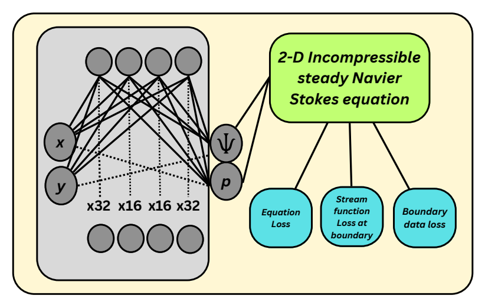

# PINNs for Data-Efficient Reconstruction of Thermofluid Flow Fields in Classical Cavity Systems

Physics-Informed Neural Networks (PINNs) for simulation, reconstruction, and analysis of lid-driven cavity flow, natural convection, and mixed convection in a square cavity.

## Overview

A PINN framework is employed to reconstruct temperature and flow fields with extremely sparse or no labelled data. The governing physics (2D incompressible Navier-Stokes with Boussinesq approximation, heat transfer equation, boundary conditions) are embedded directly into the loss function.

- **Pure lid-driven cavity**: reconstructed with zero labelled data (PDE residual only)
- **Natural & mixed convection**: reconstructed from sparse temperature measurements (downsampled from numerical simulations at Ra = 10³ to 10⁶)

## Geometry


## Network Architecture



## Governing Equations

### Continuity

$$
\frac{\partial u}{\partial x} + \frac{\partial v}{\partial y} = 0
$$

### x-momentum

$$
u \frac{\partial u}{\partial x} + v \frac{\partial u}{\partial y} = -\frac{\partial p}{\partial x} + \frac{1}{\text{Re}} \left( \frac{\partial^2 u}{\partial x^2} + \frac{\partial^2 u}{\partial y^2} \right)
$$

### y-momentum (with buoyancy term)

$$
u \frac{\partial v}{\partial x} + v \frac{\partial v}{\partial y} = -\frac{\partial p}{\partial y} + \frac{1}{\text{Re}} \left( \frac{\partial^2 v}{\partial x^2} + \frac{\partial^2 v}{\partial y^2} \right) + \frac{\text{Ra}}{\text{Re}^2 \cdot \text{Pr}} \, T
$$

### Energy Equation (Heat Transfer)

$$
u \frac{\partial T}{\partial x} + v \frac{\partial T}{\partial y} = \frac{1}{\text{Re} \cdot \text{Pr}} \left( \frac{\partial^2 T}{\partial x^2} + \frac{\partial^2 T}{\partial y^2} \right)
$$

## PINN Formulation

### Physics Loss (PDE residuals)

$$
\mathcal{L}_{\text{phys}} = \mathbb{E}_{\Omega} \left( \mathcal{R}_{\text{cont}}^2 + \mathcal{R}_{x}^2 + \mathcal{R}_{y}^2 + \mathcal{R}_{T}^2 \right)
$$

### Boundary Loss

$$
\mathcal{L}_{\text{bnd}} = \mathbb{E}_{\partial \Omega} \left( (u - u_b)^2 + (v - v_b)^2 \right) + \mathbb{E}_{\Gamma_D} (T - T_b)^2 + \mathbb{E}_{\Gamma_N} \left( \frac{\partial T}{\partial n} \right)^2
$$

### Data Loss (sparse temperature measurements)

$$
\mathcal{L}_{\text{data}} = \mathbb{E}_{\mathcal{D}} \left( T - T^{\text{data}} \right)^2
$$

### Total Loss

$$
\mathcal{L} = \lambda_{\text{phys}} \mathcal{L}_{\text{phys}} + \lambda_{\text{bnd}} \mathcal{L}_{\text{bnd}} + \lambda_{\text{data}} \mathcal{L}_{\text{data}}
$$

## Adaptive Loss Weighting: GradNorm

GradNorm balances multiple loss terms by making their gradient magnitudes equal.

### How it works:

1. Compute gradient norm for each loss term: $G_i = \| \nabla W \cdot \mathcal{L}_i \|$
2. Compute average gradient norm across all terms: $\bar{G}$
3. Compute relative inverse training rate: $r_i = \frac{\tilde{\mathcal{L}}_i}{\mathbb{E}[\tilde{\mathcal{L}}_i]}$
4. Target gradient norm for term $i$: $G_i \rightarrow \bar{G} \times r_i^\alpha$
5. Update weights $w_i$ to move actual $G_i$ toward target

### Weight update rule:

$$
w_i(t+1) = w_i(t) \cdot \exp\left( \frac{\bar{G}(t)}{G_i(t)} \cdot r_i(t)^\alpha \right)
$$

where $\alpha$ is a hyperparameter (typically 0.12) controlling the strength of balancing.

**Intuition:** Terms with larger gradients (dominating training) get smaller weights, while terms with smaller gradients (ignored) get larger weights.

## Results

| Case | Ra | Re | Pr | Error |
|------|----|----|----|-------|
| Mixed convection | 10³ | 10 | 0.71 | < 1% |
| Mixed convection | 10⁴ | 10 | 0.71 | < 6.5% |
| Mixed convection | 10⁵ | 10 | 0.71 | < 10% |

## Requirements

```bash
pip install tensorflow numpy matplotlib
