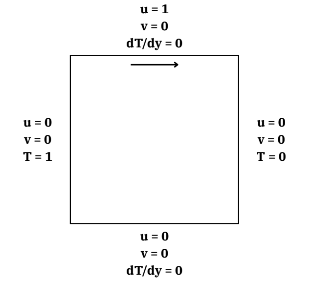

# PINNs for Data-Efficient Reconstruction of Thermofluid Flow Fields in Classical Cavity Systems

Physics-Informed Neural Networks (PINNs) for simulation, reconstruction, and analysis of lid-driven cavity flow, natural convection, and mixed convection in a square cavity.

## Overview

A PINN framework is employed to reconstruct temperature and flow fields with extremely sparse or no labelled data. The governing physics (2D incompressible Navier-Stokes, heat transfer equation, boundary conditions) are embedded directly into the loss function.

- **Pure lid-driven cavity**: reconstructed with zero labelled data (PDE residual only)
- **Natural & mixed convection**: reconstructed from sparse temperature measurements (downsampled from numerical simulations at Ra = 10³ to 10⁶)

## Geometry

  <!-- Add your geometry image here -->

## Network Architecture

  <!-- Add your network architecture image here -->

## Governing Equations

### 2D Incompressible Navier-Stokes (x-momentum)

$$
u \frac{\partial u}{\partial x} + v \frac{\partial u}{\partial y} + \frac{1}{\rho} \frac{\partial p}{\partial x} - \frac{1}{\text{Re}} \left( \frac{\partial^2 u}{\partial x^2} + \frac{\partial^2 u}{\partial y^2} \right) = 0
$$

### 2D Incompressible Navier-Stokes (y-momentum)

$$
u \frac{\partial v}{\partial x} + v \frac{\partial v}{\partial y} + \frac{1}{\rho} \frac{\partial p}{\partial y} - \frac{1}{\text{Re}} \left( \frac{\partial^2 v}{\partial x^2} + \frac{\partial^2 v}{\partial y^2} \right) = 0
$$

### Continuity

$$
\frac{\partial u}{\partial x} + \frac{\partial v}{\partial y} = 0
$$

### Heat Transfer (Energy Equation)

$$
u \frac{\partial T}{\partial x} + v \frac{\partial T}{\partial y} - \frac{1}{\text{Re} \cdot \text{Pr}} \left( \frac{\partial^2 T}{\partial x^2} + \frac{\partial^2 T}{\partial y^2} \right) = 0
$$

## PINN Formulation

### Physics Loss

$$
\mathcal{L}_{\text{phys}} = \mathbb{E}_{\Omega} \left( \mathcal{R}_{x}^{2} + \mathcal{R}_{y}^{2} + \mathcal{R}_{T}^{2} \right)
$$

### Boundary Loss

$$
\mathcal{L}_{\text{bnd}} = \mathbb{E}_{\partial \Omega} \left( (\psi - \psi_b)^2 + \| \mathbf{u} - \mathbf{u}_b \|^2 \right) + \mathbb{E}_{\Gamma_D} (T - T_b)^2 + \mathbb{E}_{\Gamma_N} \left( \frac{\partial T}{\partial n} \right)^2
$$

### Data Loss (sparse temperature measurements)

$$
\mathcal{L}_{\text{data}} = \mathbb{E}_{\mathcal{D}} \left( T - T^{\text{data}} \right)^2
$$

### Total Loss

$$
\mathcal{L} = \lambda_{\text{phys}} \mathcal{L}_{\text{phys}} + \lambda_{\text{bnd}} \mathcal{L}_{\text{bnd}} + \lambda_{\text{data}} \mathcal{L}_{\text{data}}
$$

## Adaptive Loss Weighting: GradNorm

To balance competing loss terms across different Rayleigh numbers, GradNorm is used for adaptive loss weighting. The approach dynamically adjusts loss weights based on the gradient magnitudes of each task, ensuring no single physics term dominates training.

$$
w_i(t) \leftarrow w_i(t) \cdot \exp\left( \frac{\bar{G}(t)}{G_i(t)} \cdot r_i(t) \right)
$$

where $w_i$ are the loss weights, $G_i$ is the gradient norm for task $i$, $\bar{G}$ is the mean gradient norm, and $r_i$ is the relative inverse training rate.

## Results

| Case | Ra | Re | Pr | Error |
|------|----|----|----|-------|
| Natural convection | 10³ | 10 | 0.71 | < 1% |
| Natural convection | 10⁴ | 10 | 0.71 | < 6.5% |
| Mixed convection | 10⁵ | 10 | 0.71 | < 10% |

## Requirements
